# NXP Application Code Hub

## NXP EasyEVSE iMXRT106x 

EasyEVSE is a simulated electric vehicle charging station, J1772 and ISO 15118-2/-20 compliant, connected to a CitrineOS OCPP server over Ethernet or Wi-Fi communication. The provided application is available in two flavors. One is the basic enablement, available on GitHub, while the full enablement can be found on [nxp.com](https://www.nxp.com/design/design-center/development-boards-and-designs/easyevse-ev-charging-station-development-platform-mcu-rtos:CONNECTED-EV-CHARGING-STATION).  Basic enablement provides:<ul><li>Graphical UI using LVGL and NXP GUI Guider tool</li><li>Network connectivity using either Ethernet or Wi-Fi </li><li>OCPP server connectivity using security profile 1</li><li>EVSE-SIG-BRD2X add-on development board communication for `J1772` vehicle charger standard</li><li>Kinetis KM3x Metrology MCU communication.</li></ul>Full enablement provides the following additional functionalities: <ul><li>Integration with Sevenstax `ISO15118-2` and `ISO15118-20` high level charging protocol using the HomePlug Green PHY (HPGP) transceiver (Lumissil IS32CG5317)</li><li>Integration with NXP CLRC663 NFC for external identification method, including MIFARE DUOX support</li></ul>

The EasyEVSE purpose is to deliver both EV and EVSE reference applications based on NXP kits.

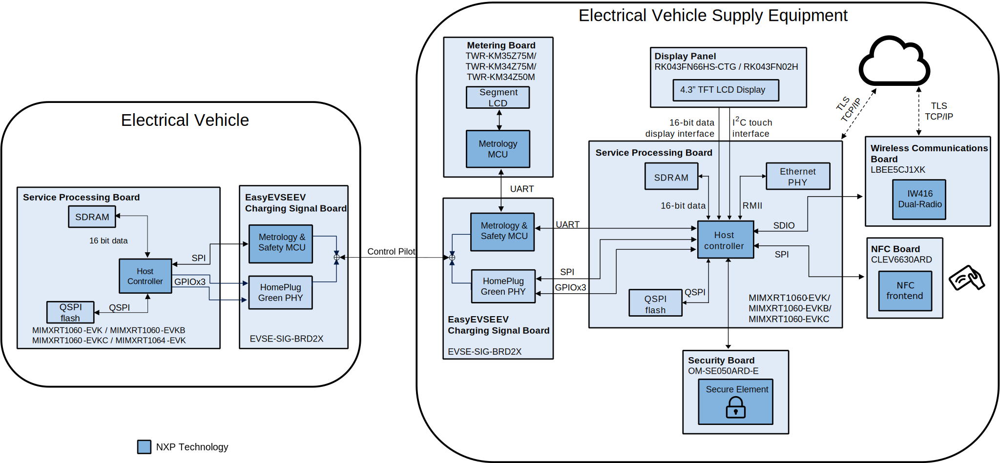

Documentation, videos and more can be found at [EasyEVSE](https://www.nxp.com/design/design-center/development-boards-and-designs/easyevse-ev-charging-station-development-platform-mcu-rtos:CONNECTED-EV-CHARGING-STATION).
#### Boards: MIMXRT1064-EVK, MIMXRT1060-EVK, MIMXRT1060-EVKB, MIMXRT1060-EVKC, EVSE-SIG-BRD2X
#### Categories: Industrial, User Interface, Networking, Cloud Connected Devices, HMI, RTOS, Wireless Connectivity
#### Peripherals: DISPLAY, DMA, ETHERNET, FLASH, GPIO, I2C, SDIO, SDMMC, SPI, UART, USB
#### Toolchains: MCUXpresso IDE

## Table of Contents
1. [Software](#step1)
2. [Hardware](#step2)
3. [Setup](#step3)
4. [Results](#step4) 
5. [Limitations](#step5)
6. [Support](#step6)
7. [Release Notes](#step7)

## 1. Software
* [MCUXpresso IDE V25.6 or later](https://www.nxp.com/design/design-center/software/development-software/mcuxpresso-software-and-tools-/mcuxpresso-integrated-development-environment-ide:MCUXpresso-IDE) or VS Code with MCUXpresso extension
* SDK_2_16_000_EVK-MIMXRT1064 for the i.MXRT1064 project
* SDK_2_16_100_EVK-MIMXRT1060 for the i.MXRT1060 project

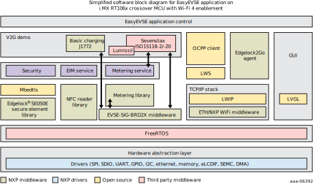

## 2. Hardware
Mandatory hardware:
* MIMXRT1064-EVK or MIMXRT1060-EVK or MIMXRT1060-EVKB or MIMXRT1060-EVKC on EV side
* MIMXRT1060-EVK or MIMXRT1060-EVKB or MIMXRT1060-EVKC on EVSE side
* OM-SE050ARD-E
* TWR-KM35Z75M or TWR-KM34Z50M or TWR-KM34Z75M
* 2x EVSE-SIG-BRD2X
* RK043FN66HS-CTG or RK043FN02H

Optional hardware boards:
* Murata Type 1XK: 802.11a/b/g/n Wi-Fi + Bluetooth 5.2 Module
* CLEV6630ARD

Full list of evaluation kits and miscellaneous needed can be found in the [User Guide](https://www.nxp.com/doc/CCEVCPGSUG).

## 3. Setup

### 3.1 Step 0: Prerequisites

#### Setup EVSE-SIG-BRD2X

Before starting to use the EVSE software, clone the [repository](https://mcuxpresso.nxp.com/appcodehub?search=dm-lpc5536-evse-sigbrd) and setup the EVSE-SIG-BRD2X device. This add-on board is mandatory to achieve communication between EV and EVSE.

#### Setup CitrineOS OCPP server (CSMS)

EasyEVSE is a development platform that enables you to develop and run a simulated electric vehicle charging station managed by an open source Charging Station Management System (CSMS), CitrineOS. To set up your CitrineOS CSMS, follow the instructions in the *Charging Station Management System (CSMS) Installation and Configuration User Guide* (document [UG10362](https://www.nxp.com/doc/UG10362)). Our EVSE does not support security profile 2, so the steps described in chapter `Enabling TLS` are not valid for this platform.

##### CitrineOS Web UI

To open the CitrineOS Web UI, follow the steps below:
1. In your browser, go to http://<machine-ip>:3000, where machine-ip is the IP address of the machine that hosts CitrineOS core.
1. Use administrator credentials to log in.

##### Charge point registration

Before exchanging information with CitrineOS, the charging station must be registered with the CSMS. When authenticating to CitrineOS, the EasyEVSE application uses security level 1, leveraging basic HTTP authentication.

##### Creating a new charging station

To create a new charging station in your CSMS, follow the steps below:
1. In your CitrineOS interface, in the left panel, go to the “Charging Stations” window.
2. Click the “Add New Charging Station” button.

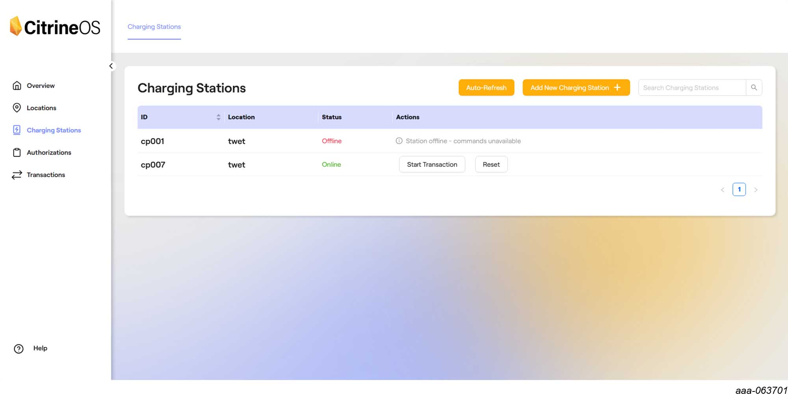

3. In the “Charging Station Id” field, add a unique name to identify your charging station (e.g. “cp001”).
Remember this registration ID as it is needed by the EasyEVSE application when connecting to the
CitrineOS.

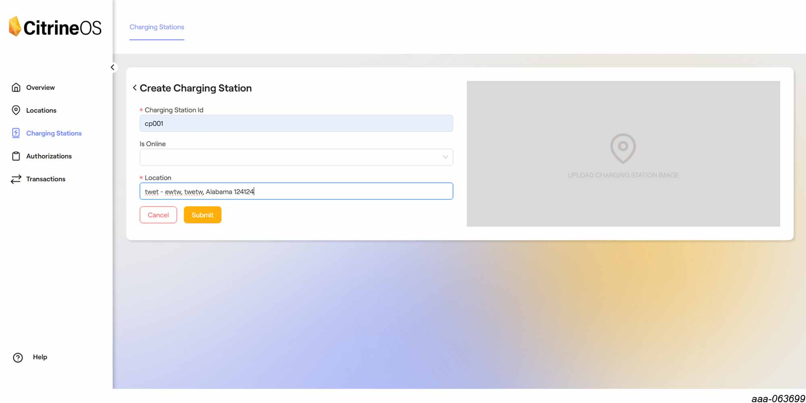

4. In the “Location” field, select an existing location or create one, using the “Locations” tab.
5. Click “Submit”.
6. In the “Charging Stations” window, you should see your charging station with the corresponding ID and the
“Offline” status.
7. Click on your specific charging station and go to "Add Connector". Use 'ConnectorID' = 1 and 'ConnectorIDType' = 1, when prompted (the EasyEVSE application is configured to run as EVSE: 1, connector: 1).

##### Manage authorization list

To add your authorization tokens in the authorization list, follow the steps below:
1. In your CitrineOS interface, in the left panel, go to the “Authorizations” window.
2. Click the “Add New Authorization” button.

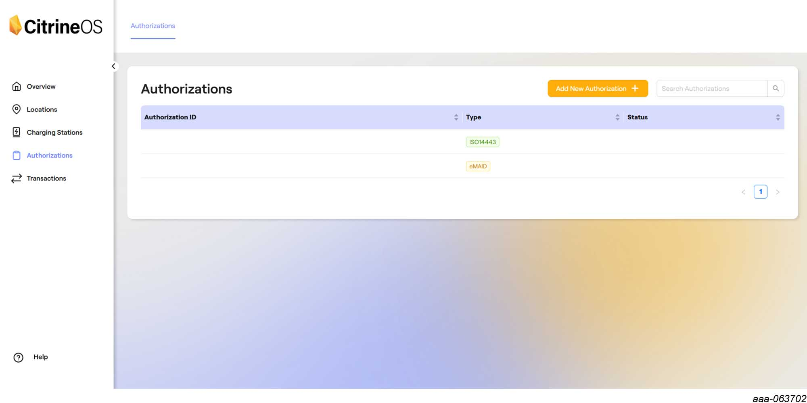

3. In the “Authorization Id Token” field, add your authorization token Id. In the “IdToken Type” dropdown list, select your token type. The three authorization types available with the EasyEVSE application (full enablement version) are described below:
- If you want to register an NFC card, select ‘ISO14443’ as the token type and your card’s UID in the “Authorization Id Token” field.

**Note**: You can get the card UID from the EasyEVSE logs (search for 'Card UID' after tapping the card), the EasyEVSE GUI or by using an NFC reader application.

   - If you want to register a contract certificate for Plug and Charge, select ‘eMAID’ as the token type and add your eMAID value in the “Authorization Id Token” field.

**Note**: You can get the eMAID from the EasyEVSE logs (search for 'emaid value') or extract the CN field from the certificate using a crypto tool/library. The eMAID value is different for ISO15118-2 and ISO15118-20.

   - If you want to register a local token, select ‘Local’ as the token type and add the string “AUTH_FROM_CLI” in the “Authorization Id Token” field. In the EasyEVSE application, you can do local authorizations using the ‘auth true’ command in the cli.

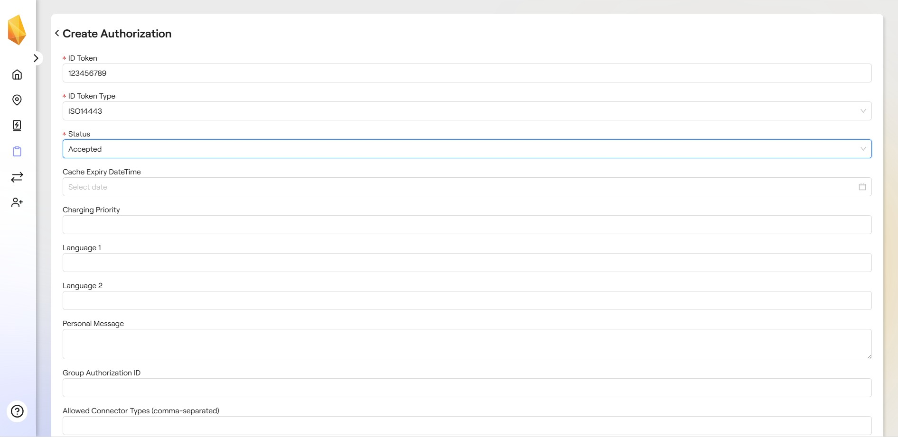

### 3.2 Step 1: Software setup
Clone the [APP-CODE-HUB/rd-nxp-easyevse-imxrt106x](https://github.com/nxp-appcodehub/rd-nxp-easyevse-imxrt106x) repository.

#### Import the project in MCUXpresso IDE or VS Code

To import the project in MCUXpresso IDE:
1. Proceed to import the project from filesystem
2. Choose the previously cloned archive
3. Go to project selection
4. MCUXpresso IDE or VS Code will automatically detect 2 projects:
* LVGL project. We removed the LVGL component from the main project because LVGL is usually generated automatically using GUI Guider and it is built only once.
* EasyEVSE project with multiple build configurations: EV, EV_UI, EVSE and EVSE_ETH on i.MXRT1060 and only EV and EV_UI on i.MXRT1064. EV_UI, EVSE and EVSE_ETH configurations link the LVGL library.

The EVSE project offers support for both i.MXRT1060 and i.MXRT1064 MCUs. Select the folders corresponding to the existing EVK.

5. Finish

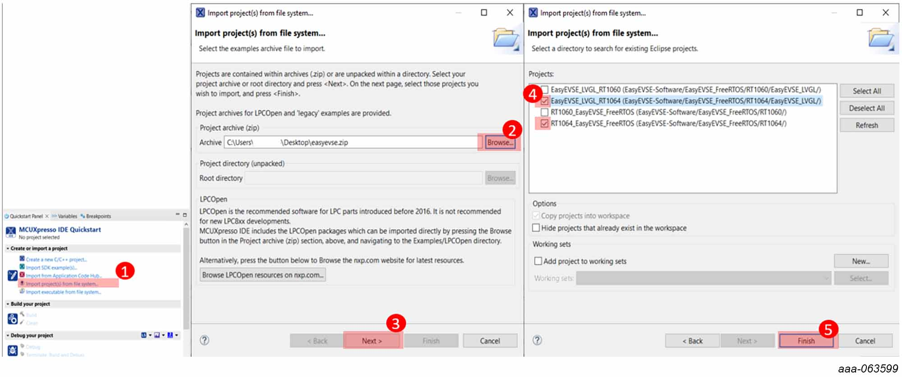

In this example we import i.MXRT1064 project, but the steps are the same for both MCUs.

To import the protect in VS Code:
1. Press Ctrl+Shift+P to open a search bar in VS Code
2. Search _MCUXpresso for VS Code: Import Multiple Projects_
3. Browse the project corresponding to your board (RT1060 or RT1064)
4. Select RT106x and EasyEVSE_LVGL projects, then click OK
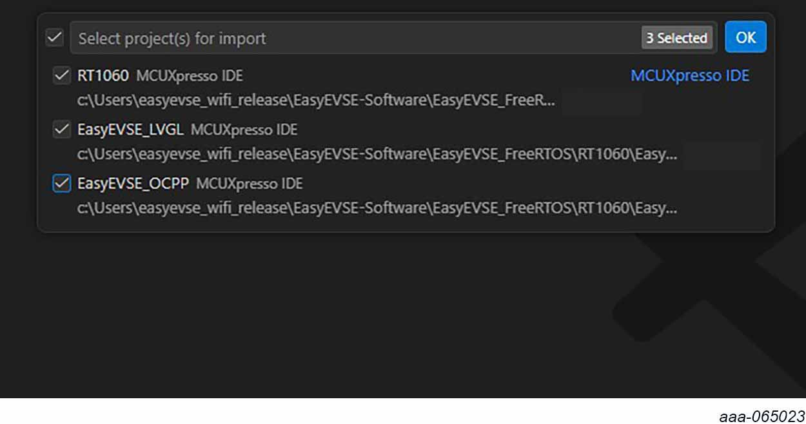

#### Configure the EasyEVSE application to connect to your CSMS

In the EasyEVSE application code, to set up your connection to CitrineOS CSMS, go to the common/source/config/EVSE_ConnectivityConfig.h file and:

1. Set the EVSE_OCPP_SERVER_URL macro to the URL of the CitrineOS instance that you are using.(e.g. "ws://192.168.8.3:8081")
2. Set the CHARGE_POINT_ID macro to the ID of the charge point as registered in CitrineOS. (e.g. "cp001")

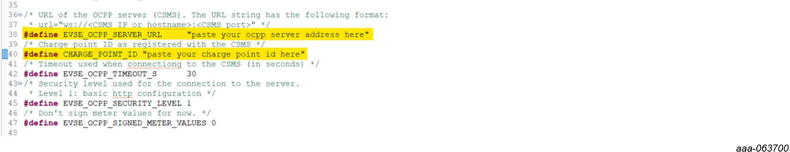

#### Flash the bords

To flash the EVKs, follow these steps:
1. Build the LVGL project

2. Build the EasyEVSE project in EVSE or EVSE_ETH configuration, depending on your hardware setup

3. Flash the i.MXRT1060 which will be used as EVSE
4. Build the EasyEVSE project in EV configuration
5. Flash the RT106x which will be used as EV

>**Note**: In MCUXpresso, hover the hammer icon to check and change the build configuration. 

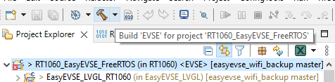

>**Note**: In VS Code, expand _Build Configurations_ menu and select the desired build configuration by checking the tick on the right. 

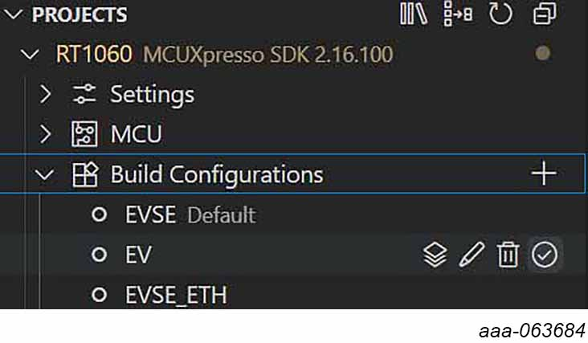

---

### 3.2 Step 2: Hardware Assembly

There are multiple options available for setting up the system.
The assembly procedure is different based on the connectivity method, power supply for the EVSE-SIG-BRD2X and available hardware.

For instance, choosing the Wi-Fi connectivity will result in EVSE-SIG-BRD2X to not be connected in the Arduino interface. The SDIO interface pins are shared with the only SPI interface from the Arduino header.

> **_NOTE:_** If EVSE-SIG-BRD2X board is not connected via Ethernet and it shares the same SPI interface as the NFC frontend, then SPI must be reinitialized on the fly, as EVSE-SIG-BRD2X board and NFC frontend are configured to operate in different SPI modes. The EasyEVSE application already deals with this scenario.

Check `Board setup, wiring and assembly` chapter from the User Guide based on your existing hardware.

### 3.3 Step 3: Power the boards
1. Power the i.MXRT106x board using the external power supply (recommended) J40: 1-2
2. Power the EVSE-SIG-BRD2X if external power supply was chosen (recommended)
3. Power the TWR-KM35Z75M using external USB cable

## 4. Results
1. EVSE project

Once the i.MXRT106x is powered the screen will light up and it will display the UI.

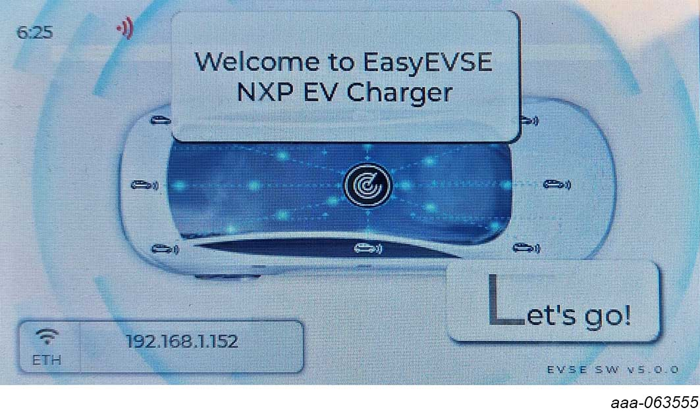

In Linking screen popup, please check that the EVSE-SIG-BRD2X connection matches with the expected hardware configuration.

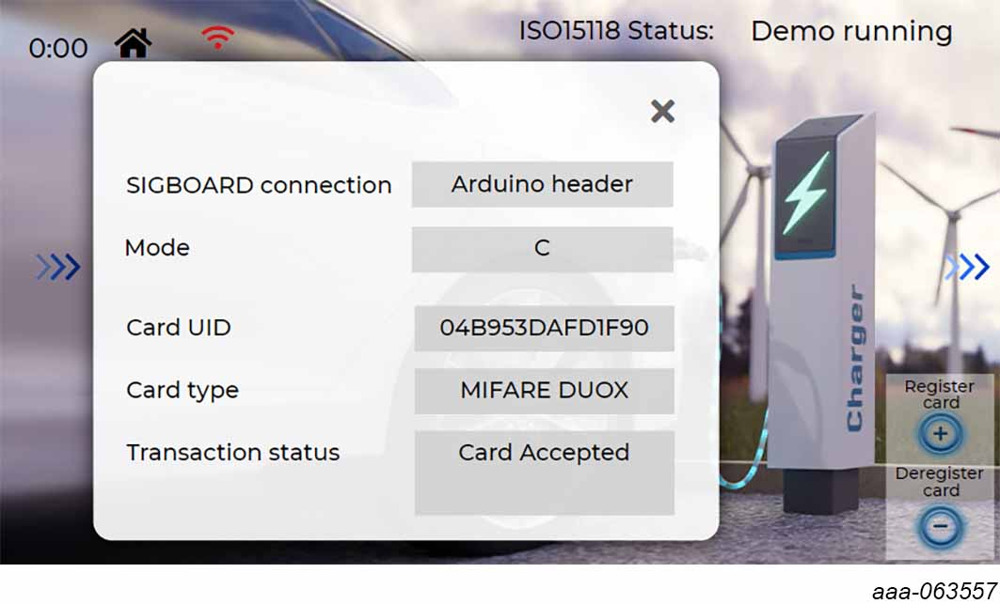

2. EV project

Currently, the EV project has some basic UI capabilities. If the UI is enabled and the setup is correct, you will see the UI on the display. In order to check if the project is working, if UI is disabled, connect an USB cable in the J1 USB interface (connected to the LinkServer) to see the logs. Using a terminal emulator (230400 bps), logs should appear on the serial terminal connected to the board.

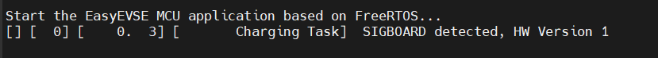

The log from above is mandatory.

3. Start charging session

Once both boards have booted, connect the 2 EVSE-SIG-BRD2X CP pins together.

Before the charging actually starts, the charging session needs to be authorized. This can be done in two ways:
1. When OCPP is enabled, the server authorizes the charging session only if the card used for authentication has already been registered into the server.
2. When OCPP is disabled and NFC is enabled, the authorization is done using a whitelist of RFID cards stored locally on the EVSE board. Each list item is described as a pair of card UID + card type. If the list is left empty, the charging session is authorized by default. If the list contains at least one card, then the card presented to the NFC reader when authentication is requested is compared to each item of the list and it is accepted only if both the UID and type match with the registered cards. If a card is MIFARE DUOX, it also needs to pass all the security checks in order to be accepted.
3. If both OCPP and NFC are disabled, CLI authorization must be used and the charging session starts afterwards.

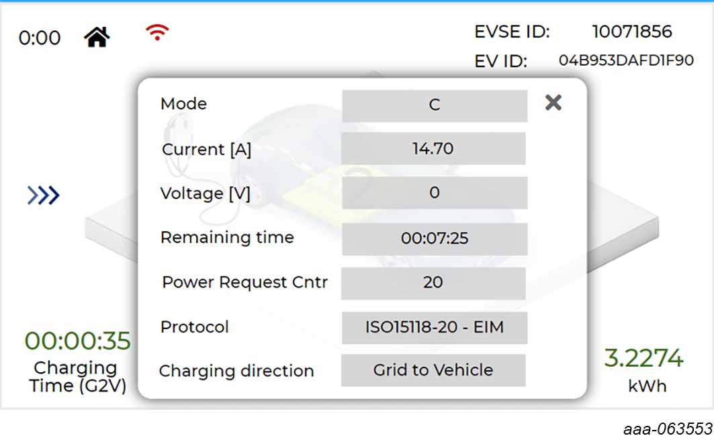

On the Linking screen popup or Charging screen popup you can spot the charging state (Mode) switch from A -> B -> C.

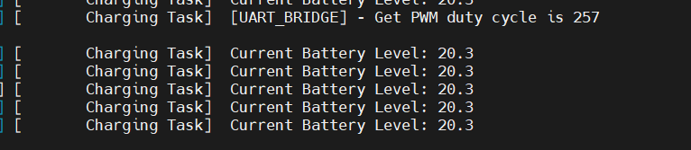

On the EV side, in the logs, you will spot messages like above. The PWM dictates the charge speed and the current battery level steadily increases.

## 5. Limitations

Limitations with the current implementation:
1. In case of a disconnect from the CSMS, the EVSE will try to reconnect for approximately 15 minutes. After that time, you will need to reset the board to reconnect.
2. The remote start and stop functionalities have not been validated with CitrineOS CSMS.
3. When authenticating to the CSMS, the EasyEVSE application uses security level 1, leveraging basic HTTP authentication, secure connection is not enabled at the moment

## 6. Support

Questions regarding the content/correctness of this example can be entered as Issues within this [GitHub repository](https://github.com/nxp-appcodehub/rd-nxp-easyevse-imxrt106x/issues).

>**Warning**: For more general technical questions regarding NXP Microcontrollers and the difference in expected functionality, enter your questions on the [NXP Community Forum](https://community.nxp.com/)

#### Project Metadata

<!----- Boards ----->

<!----- Categories ----->

<!----- Peripherals ----->

<!----- Toolchains ----->

Questions regarding the content/correctness of this example can be entered as Issues within this GitHub repository.

>**Warning**: For more general technical questions regarding NXP Microcontrollers and the difference in expected functionality, enter your questions on the [NXP Community Forum](https://community.nxp.com/)

## 7. Release Notes
| Version | Description / Update                           | Date                        |
|:-------:|------------------------------------------------|----------------------------:|
|5.0.8     | 
Enabled OCPP communication
 
Added MIFARE DUOX support
 
Updated SDK version to 2.16
 
Added VS Code support
 
Updated UI starting from GUI Guider example
 
Dropped Azure Cloud support
 
Dropped EVSE support on i.MXRT1064 
 | December 15th 2025 |
|4.0.4     | 
Added ISO15118-20 on the MCU
 
Updated UI to address the ISO15118-20
 
Updated SDK version to 2.15
 
Added new build configuration for EVSE-SIG-BRD connection using the ETH
 | April 25th 2025 |
|3.0.6     | Replaced Baltimore CA certificate with DigiCert Global Root G2 certificate for DPS registration        | October 15th 2024 |
|3.0.4     | Initial release on Application Code Hub        | August 20th 2024 |
