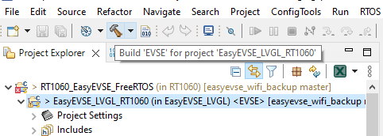

# NXP Application Code Hub

## NXP EasyEVSE iMXRT106x 

EasyEVSE is a simulated electric vehicle charging station, J1772 compliant, connected to the Microsoft Azure IoT Central over Ethernet or Wi-Fi communication. The provided application is available in 2 flavors. One is the basic enablement, available on GitHub, while the full enablement can be found on [nxp.com](https://www.nxp.com/design/design-center/development-boards-and-designs/easyevse-ev-charging-station-development-platform-mcu-rtos:CONNECTED-EV-CHARGING-STATION).  Basic enablement provides:<ul><li>Graphical UI using LVGL and NXP GUI Guider tool</li><li>Network connectivity using either Ethernet or Wi-Fi </li><li>Secure Microsoft Azure Cloud connectivity using the SE050 secure element</li><li>EVSE-SIG-BRD add-on development board communication for J1772 vehicle charger standard</li><li>Kinetis KM3x Metrology MCU communication.</li></ul>Full enablement provides the following additional functionalities: <ul><li>Integration with Sevenstax `ISO15118-2` and `ISO15118-20` high level charging protocol using the HomePlug Green PHY (HPGP) transceiver (Lumissil IS32CG5317)</li><li>Integration with NXP CLRC663 NFC for external identification method</li></ul>

The EasyEVSE purpose is to deliver both EV and EVSE reference applications based on NXP kits.

EasyEVSE Full System.

Documentation, videos and more can be found at [EasyEVSE](https://www.nxp.com/design/design-center/development-boards-and-designs/easyevse-ev-charging-station-development-platform-mcu-rtos:CONNECTED-EV-CHARGING-STATION).
#### Boards: EVK-MIMXRT1064, EVK-MIMXRT1060
#### Categories: Industrial, User Interface, Networking, Cloud Connected Devices, HMI, RTOS, Wireless Connectivity
#### Peripherals: DISPLAY, DMA, ETHERNET, FLASH, GPIO, I2C, SDIO, SDMMC, SPI, UART, USB
#### Toolchains: MCUXpresso IDE

## Table of Contents
1. [Software](#step1)
2. [Hardware](#step2)
3. [Setup](#step3)
4. [Results](#step4) 
5. [Support](#step5)
6. [Release Notes](#step6)

## 1. Software
* [MCUXpresso IDE V11.9 or later](https://www.nxp.com/design/design-center/software/development-software/mcuxpresso-software-and-tools-/mcuxpresso-integrated-development-environment-ide:MCUXpresso-IDE)
* SDK_2_15_0_EVK-MIMXRT1064 for the i.MXRT1064 project
* SDK_2_15_0_EVK-MIMXRT1060 for the i.MXRT1060 project

EasyEVSE EVSE project, software block diagram.

## 2. Hardware
Mandatory hardware:
* i.MXRT106x EVK x2
* OM-SE050ARD-E
* TWR-KM35Z75M
* EVSE-SIG-BRD1X/2X x2
* RK043FN66HS-CTG

Optional hardware boards:
* Murata Type 1XK: 802.11a/b/g/n Wi-Fi + Bluetooth 5.2 Module
* CLEV6630ARD

Full list of evaluation kits and miscellaneous needed can be found in the UG.

## 3. Setup

### 3.1 Step 0: Prerequisite

Before starting to use the EVSE software, clone and setup the EVSE-SIG-BRD device. This add-on board is mandatory to achieve communication between EV and EVSE. More can be found [here](https://mcuxpresso.nxp.com/appcodehub?search=dm-lpc5536-evse-sigbrd)  
### 3.2 Step 1: Software setup
* Clone the APP-CODE-HUB/rd-nxp-easyevse-imxrt106x
* Import the project from filesystem or archive.

The EVSE project supports both the  i.MXRT1060 and i.MXRT1064 EVK.

Select the folder corresponding with the existing EVK.

In our example we showed for the RT1064.
MCUXpresso will automatically detect 2 projects:
1. LVGL project. We removed the LVGL component from the main project because LVGL is usually generated automatically using the GUI GUIDER and it is built only once.
2. EasyEVSE project with EV/EVSE configurations that links the lvgl library  

* Build the LVGL project

* Build the EasyEVSE project in the EVSE configuration

* Flash the RT106X which will be used as EVSE
* Build the EasyEVSE project in the EV configuration
* Flash the RT106x which will be used as EV

>**Note**: Hover the hammer icon to check and change the configuration of the EasyEVSE project. 

---

### 3.2 Step 2: Hardware Assembly

The system offers versatility in terms of possible connection.
The system assembly is different based on the connectivity method, power supply for the EVSE-SIG-BRD and available hardware.
For instance choosing the Wi-Fi connectivity will result in EVSE-SIG-BRD to not be connected in the Arduino Interface. The SDIO interface pins are shared with the only SPI from the Arduino Interface.

Check the `Hardware setup` or `Board setup, wiring and assembly`,  chapter from the UG, based on your existing hardware.

### 3.3 Step 3: Power the boards
1. Power the i.MXRT1064 board using the external power supply (recommended) J40: 1-2
2. Power the EVSE-SIG-BRD if external power supply was chosen as the go power configuration
3. Power the TWR-KM35Z75M using external USB cable

## 4. Results
1. EVSE project

Once the i.MXRT106x is powered the screen will light up and it will display the UI.
The screen will display the screen present in the picture.

In the ISO15118 screen, please check that the EVSE-SIG-BRD connection matches with the expected hardware configuration.

2. EV project

Currently, the EV project has no UI capabilities. In order to check if the project is working connect an USB cable in the J1 USB interface (Connected to the LinkServer) to see the logs. Using a terminal emulator, logs should appear on the serial terminal connected to the board.

The log from above is mandatory.

3. Start charging session

Once both boards have booted, connect the 2 EVSE-SIG-BRD CPs together. 

On the EVSE side, in the EVSE Menu screen you can spot the Charge State switch from color red to color green

On the EV side, in the logs, you will spot messages like above. The PWM dictates the charge speed and the Current Battery Level steadily increases.

## 5. Support
Questions regarding the content/correctness of this example can be entered as Issues within this [GitHub repository](https://github.com/nxp-appcodehub/rd-nxp-easyevse-imxrt106x/issues).

>**Warning**: For more general technical questions regarding NXP Microcontrollers and the difference in expected functionality, enter your questions on the [NXP Community Forum](https://community.nxp.com/)

#### Project Metadata

<!----- Boards ----->

<!----- Categories ----->

<!----- Peripherals ----->

<!----- Toolchains ----->

Questions regarding the content/correctness of this example can be entered as Issues within this GitHub repository.

>**Warning**: For more general technical questions regarding NXP Microcontrollers and the difference in expected functionality, enter your questions on the [NXP Community Forum](https://community.nxp.com/)

## 6. Release Notes
| Version | Description / Update                           | Date                        |
|:-------:|------------------------------------------------|----------------------------:|
|4.0.4     | Add ISO15118-20 on the MCU   Update UI to address the ISO15118-20   Update SDK version to 2.15    Add new build configuration for EVSE-SIG-BRD connection using the ETH| April 25th 2025 |
|3.0.6     | Replaced Baltimore CA certificate with DigiCert Global Root G2 certificate for DPS registration        | October 15th 2024 |
|3.0.4     | Initial release on Application Code Hub        | August 20th 2024 |
